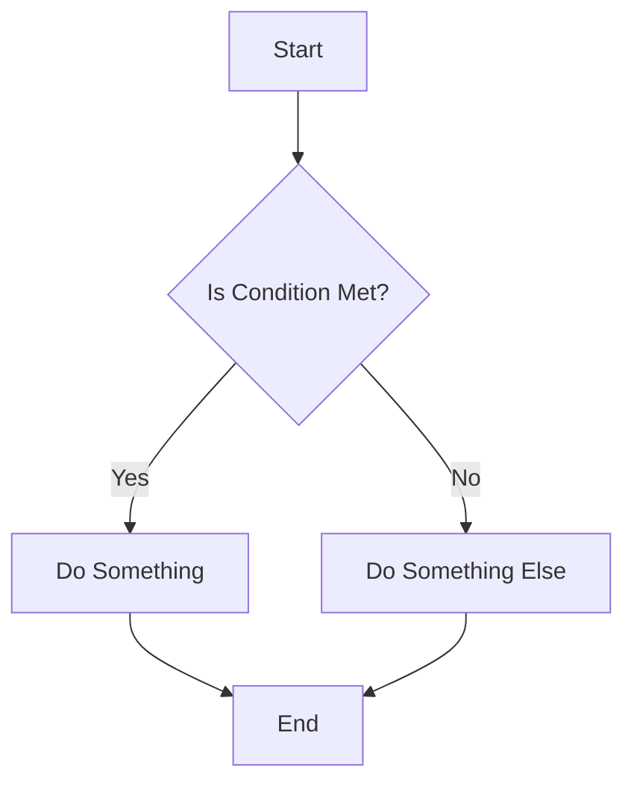

# Vidst Refactoring - Documentation Rules

## When to apply
@semantics Applies when creating or editing docstrings, documentation files, or when the user requests adding documentation.
@files src/**/*.py docs/**/*.md **/*.rst docs/**/*.rst

## Docstring Standards

Follow these docstring standards for all new and refactored code to ensure consistency and clarity throughout the Vidst project.

## Key Principles

1. **Essential Only**: Document what's necessary, not everything possible
2. **User-Focused**: Write for the developers who will use your code
3. **Practical Examples**: Include examples for non-obvious functionality
4. **Keep It Current**: Update docstrings when you change functionality

## Docstring Templates

### Module Docstrings

For module-level docstrings, place at the top of the file:

```python
"""Video processing core for scene detection and analysis.

This module provides the core functionality for processing video files,
detecting scene changes, and extracting relevant metadata.

Primary classes:
    * VideoProcessor: Main entry point for video processing
    * SceneDetector: Handles scene boundary detection

Example:
    ```python
    processor = VideoProcessor(config)
    with processor.process("video.mp4") as ctx:
        scenes = processor.detect_scenes(ctx)
    ```
"""
```

### Class Docstrings

```python
class SceneDetector:
    """Handles video scene detection and analysis.
    
    Analyzes video frame-by-frame to detect scene changes.
    
    Attributes:
        min_scene_length (float): Minimum scene length in seconds
        max_scenes (int): Maximum number of scenes to detect
    
    Example:
        ```python
        detector = SceneDetector(min_scene_length=2.0)
        scenes = detector.detect_scenes(video)
        ```
    """
```

### Method Docstrings

```python
def detect_scenes(self, video: Video) -> list[Scene]:
    """Detect scenes in a video.
    
    Args:
        video (Video): Video object to process
        
    Returns:
        list[Scene]: Detected scene objects
        
    Raises:
        ValueError: If video file is not found
    """
```

### Property Docstrings

```python
@property
def scene_count(self) -> int:
    """Number of detected scenes.
    
    Returns:
        int: Scene count
    """
```

### Constants Docstrings

```python
DEFAULT_THRESHOLD = 30.0
"""Default threshold for scene change detection.

Units: Absolute pixel difference (0-255 scale)
"""
```

## Comprehensive Example

Here's a complete example showing proper documentation for a class with methods:

```python
class TextExtractor:
    """Extracts and analyzes text from video frames.
    
    Performs OCR on video frames to identify and extract visible text.
    
    Attributes:
        languages (list[str]): Supported languages for OCR
        confidence_threshold (float): Minimum confidence score (0-1)
        
    Example:
        ```python
        extractor = TextExtractor(languages=["en"])
        text_regions = extractor.extract_text(frame)
        for region in text_regions:
            print(f"Found text: {region.text}")
        ```
    """
    
    def __init__(self, languages: list[str] = ["en"], confidence_threshold: float = 0.7):
        """Initialize text extractor.
        
        Args:
            languages: List of language codes to detect
            confidence_threshold: Minimum confidence score (0-1)
        """
        self.languages = languages
        self.confidence_threshold = confidence_threshold
        
    def extract_text(self, frame: np.ndarray) -> list[TextRegion]:
        """Extract text from a video frame.
        
        Performs OCR to identify and extract text visible in the frame.
        
        Args:
            frame: Video frame as numpy array
            
        Returns:
            List of TextRegion objects containing detected text, position, and confidence
            
        Raises:
            ProcessingError: If text extraction fails
        """
        # Implementation details...
```

## MkDocs Documentation

For markdown documentation in MkDocs, follow these guidelines:

### File Organization

```
docs/
├── index.md                     # Main landing page
├── installation.md              # Installation guide
├── getting-started.md           # Getting started guide
├── components/                  # Component documentation
│   ├── index.md                 # Overview of components
│   ├── video_processor.md       # Video processor documentation
│   └── scene_detector.md        # Scene detector documentation
├── api/                         # API reference
│   ├── index.md                 # API overview
│   ├── twelve_labs.md           # Twelve Labs API
│   └── pinecone.md              # Pinecone API
└── development/                 # Development guides
    ├── contributing.md          # Contribution guide
    ├── code_style.md            # Code style guide
    └── architecture.md          # Architecture documentation
```

### Markdown Structure

```markdown
# Component Title

## Overview

Brief description of the component and its purpose.

## Installation

```bash
pip install component
```

## Usage

```python
from component import Component

comp = Component()
result = comp.process()
```

## Configuration

| Parameter | Type | Default | Description |
|-----------|------|---------|-------------|
| `param1`  | str  | "default" | Description of param1 |
| `param2`  | int  | 42      | Description of param2 |

## Examples

### Basic Example

```python
# Example code
```

### Advanced Example

```python
# Advanced example code
```

## API Reference

### `Component.method1()`

Description of method1.

### `Component.method2()`

Description of method2.
```

## Common Documentation Tasks

### "Add Docstring to This"

When asked to "add docstring to this" for a function or class, follow these templates:

For functions:

```python
def function_name(param1: type1, param2: type2) -> return_type:
    """Short description of what the function does.
    
    More detailed explanation if needed.
    
    Args:
        param1: Description of param1
        param2: Description of param2
        
    Returns:
        Description of return value
        
    Raises:
        ExceptionType: When this exception is raised
    """
```

For classes:

```python
class ClassName:
    """Short description of what the class does.
    
    More detailed explanation if needed.
    
    Attributes:
        attr1: Description of attr1
        attr2: Description of attr2
        
    Example:
        ```python
        instance = ClassName()
        result = instance.method()
        ```
    """
```

### "Document This Module"

When asked to document a module, create a module-level docstring:

```python
"""Module name and short description.

Detailed description of what the module does and its purpose.

Primary classes:
    * Class1: Description of Class1
    * Class2: Description of Class2

Functions:
    * function1: Description of function1
    * function2: Description of function2

Example:
    ```python
    from module import Class1
    instance = Class1()
    result = instance.method()
    ```
"""
```

### "Create Documentation for This Component"

When asked to create documentation for a component, create a markdown file with:

1. Component overview
2. Installation instructions
3. Usage examples
4. Configuration options
5. API reference
6. Advanced examples

## Documentation Optimization

### DRY Principle

Follow Don't Repeat Yourself (DRY) by:

1. Referencing other documentation where appropriate
2. Using cross-references for related components
3. Linking to external resources rather than duplicating them

### Documentation Checklist

- [ ] Clear and concise description
- [ ] All parameters documented
- [ ] Return values documented
- [ ] Exceptions documented
- [ ] Usage examples provided
- [ ] Type hints included
- [ ] Code examples tested and working

## Markdown Best Practices

1. Use proper heading hierarchy (h1 > h2 > h3)
2. Use tables for structured data
3. Include code blocks with language specifiers
4. Use bullet points and numbered lists for clarity
5. Include diagrams when helpful (Mermaid syntax)
6. Link to related documentation

## Mermaid Diagrams

```markdown

```

## API Documentation

For API integrations, include:

1. Authentication requirements
2. Endpoint descriptions
3. Request and response formats
4. Error codes and meanings
5. Rate limits and quotas
6. Example requests and responses
