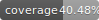

# Documentation

This directory contains project documentation.

## Structure

- `api/` - API documentation
  - `pipeline.md` - AI Pipeline Documentation and Usage
  - `config.md` - Configuration System Documentation
  - `vector_storage.md` - Vector Storage and Similarity Search
  - `error_handling.md` - Error Handling and Recovery
  - `cache.md` - Two-Level Cache System
  - `video_upload.md` - Video Upload and Validation
- `guides/` - User guides and tutorials
- `development/` - Development documentation
- `ci-cd.md` - CI/CD Pipeline Documentation
- `testing-guide.md` - Comprehensive Testing Guide

## Documentation Types

### Development Documentation
- Testing Guide
  - Test Structure and Organization
  - Test Types and Categories
  - Coverage Requirements
  - Best Practices and Patterns
- CI/CD Pipeline Setup and Usage
- Code Style Guide
- API Reference

### User Documentation
- Installation Guide
- Configuration Guide
- Usage Examples
- Troubleshooting

## Testing and Coverage

Our project maintains high code quality standards with:
- Minimum 85% code coverage requirement
- Automated coverage reporting in PRs
- Comprehensive unit and integration tests
- Detailed coverage documentation in [`testing.md`](./testing.md)

## Contributing

Please follow the documentation style guide when adding or updating documentation.

### Documentation Standards
- Use Markdown for all documentation
- Include code examples where relevant
- Keep documentation up to date with code changes
- Add diagrams using Mermaid when helpful
- Include version information where applicable 