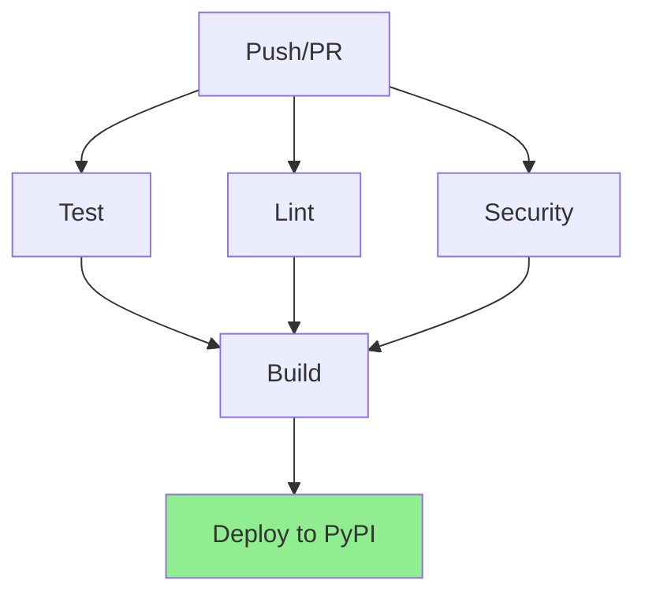

# CI/CD Pipeline Documentation

## Overview

Our CI/CD pipeline automates testing, linting, security checks, and deployment processes. It ensures code quality, maintains security standards, and provides automated releases to PyPI.

## Pipeline Structure



## Required Secrets

The pipeline requires the following repository secrets:

```yaml
OPENAI_API_KEY: OpenAI API key for GPT-4V
GEMINI_API_KEY: Google Gemini Pro Vision API key
TWELVE_LABS_API_KEY: Twelve Labs API key
PYPI_USERNAME: PyPI username
PYPI_PASSWORD: PyPI password
```

## Jobs

### Test

Runs the test suite across multiple Python versions:

```yaml
strategy:
  matrix:
    python-version: [3.9, "3.10", "3.11"]
```

Steps:
1. Set up Python environment
2. Install FFmpeg dependencies
3. Install project dependencies
4. Configure test environment
5. Run tests:
   - Unit tests
   - Integration tests
   - Performance tests
6. Upload coverage reports
7. Archive test results

Requirements:
- Minimum 85% code coverage
- All tests must pass
- Coverage reports uploaded to Codecov

### Lint

Code quality checks using multiple tools:

```bash
# Format checking
black --check src tests

# Style checking
flake8 src tests

# Modern Python linter
ruff check src tests

# Type checking
mypy src
```

### Security

Security scanning and dependency checks:

```bash
# Security scanning
bandit -r src

# Dependency security check
safety check

# Dependency review
actions/dependency-review-action
```

### Build

Package building and verification:

```bash
# Build package
python -m build

# Verify package
twine check dist/*
```

### Deploy

Automated PyPI deployment when merging to main:

```yaml
deploy:
  needs: [test, lint, security, build]
  if: github.ref == 'refs/heads/main' && github.event_name == 'push'
```

## Workflow Triggers

The pipeline runs on:
- Push to `main` or `develop` branches
- Pull requests to `main` or `develop` branches

## Configuration

### Python Versions

```yaml
python-version: [3.9, "3.10", "3.11"]
```

### Test Coverage Requirements

```yaml
coverage report --fail-under=85
```

### Artifact Retention

```yaml
retention-days: 14
```

## Best Practices

1. **Branch Protection**:
   - Require status checks to pass
   - Require code review
   - Protect the main branch

2. **Secrets Management**:
   - Use repository secrets
   - Rotate keys regularly
   - Limit secret access

3. **Test Strategy**:
   - Run fast tests first
   - Skip slow tests in PR checks
   - Maintain high coverage

4. **Dependency Management**:
   - Regular dependency updates
   - Security scanning
   - Version pinning

## Common Issues

### Test Failures

```bash
# Rerun failed tests
pytest --lf

# Debug test environment
pytest -vv --tb=long

# Check coverage locally
pytest --cov=src
```

### Lint Errors

```bash
# Auto-format code
black src tests

# Fix common issues
ruff --fix src tests

# Show detailed lint errors
flake8 src tests --show-source
```

### Build Issues

```bash
# Clean build artifacts
rm -rf dist/ build/ *.egg-info

# Rebuild package
python -m build

# Verify package
twine check dist/*
```

## Local Development

### Setting Up

```bash
# Create virtual environment
python -m venv venv
source venv/bin/activate  # or `venv\Scripts\activate` on Windows

# Install dependencies
pip install -r requirements.txt
pip install -r requirements-test.txt

# Install pre-commit hooks
pre-commit install
```

### Running Checks

```bash
# Run all checks
./scripts/run_checks.sh

# Run specific checks
pytest tests/unit/
black --check src
bandit -r src
```

## Deployment Process

1. **Automated Deployment**:
   - Merge to main branch
   - Tests, lint, and security checks run
   - Package built and verified
   - Deployed to PyPI if all checks pass

2. **Manual Release**:
   ```bash
   # Build
   python -m build
   
   # Upload to TestPyPI
   twine upload --repository testpypi dist/*
   
   # Upload to PyPI
   twine upload dist/*
   ```

## Monitoring

1. **GitHub Actions Dashboard**:
   - View workflow runs
   - Check job status
   - Download artifacts

2. **Codecov**:
   - Coverage reports
   - Coverage trends
   - PR coverage changes

3. **Security Alerts**:
   - Dependency vulnerabilities
   - Code scanning results
   - Secret scanning alerts

## Contributing

1. Create feature branch from develop
2. Make changes and commit
3. Run local checks:
   ```bash
   ./scripts/run_checks.sh
   ```
4. Push and create PR
5. Wait for CI checks to pass
6. Get code review
7. Merge to develop 